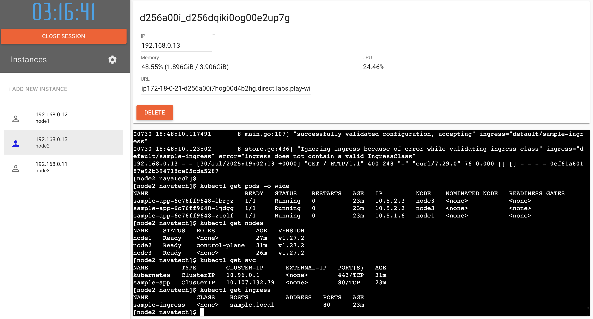
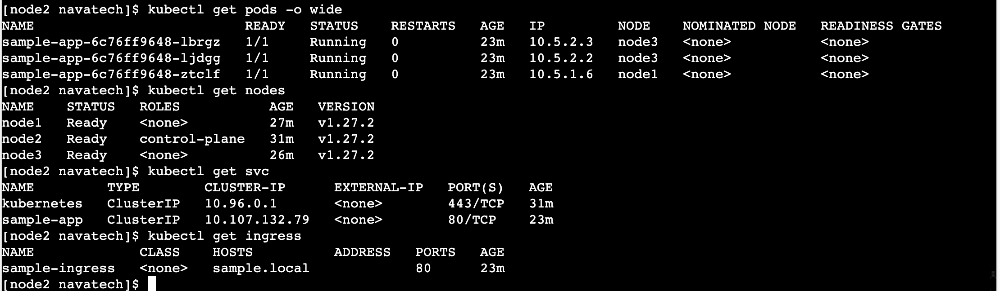

# Devops-Assignment

✅ 1. Cluster Setup (High Availability & Scalability)
a. Provision Kubernetes Cluster
Tool Choice: kubeadm for production-grade, or kind for local testing.

For HA setup with kubeadm:

Use at least 3 master nodes and 2 worker nodes.

Set up etcd cluster internally or externally.

Use a load balancer in front of control planes

For simplicity, use a cloud provider like AWS (EKS), GCP (GKE), or Minikube

✅ 2. Deploy NGINX Ingress Controller

a. Deploy NGINX Ingress

kubectl apply -f https://raw.githubusercontent.com/kubernetes/ingress-nginx/controller-v1.10.1/deploy/static/provider/cloud/deploy.yaml

Wait for the ingress controller to be ready:

kubectl get pods -n ingress-nginx
kubectl get svc -n ingress-nginx

✅ 3. Sample App + Ingress Setup
a. Deploy Sample App 
sample-app-deployment.yaml
sample-app-service.yaml
sample-app-ingress.yaml

To access locally: echo "127.0.0.1 sample.local" | sudo tee -a /etc/hosts

✅ 4. Zero-Downtime Rolling Updates
Add strategy to your Deployment:

strategy:
  type: RollingUpdate
  rollingUpdate:
    maxUnavailable: 0
    maxSurge: 1

Screenshots or output of:

kubectl get pods -o wide
kubectl get nodes
kubectl get svc
kubectl get ingress

✅ 6. Bonus
Use Helm to install NGINX and the sample app:

helm repo add ingress-nginx https://kubernetes.github.io/ingress-nginx
helm install nginx ingress-nginx/ingress-nginx

 
Deploy a redis Database

 .
├── manifests/
│   ├── sample-app-deployment.yaml
│   ├── sample-app-service.yaml
│   ├── sample-app-ingress.yaml
│   └── redis-statefulset.yaml 
└── README.md